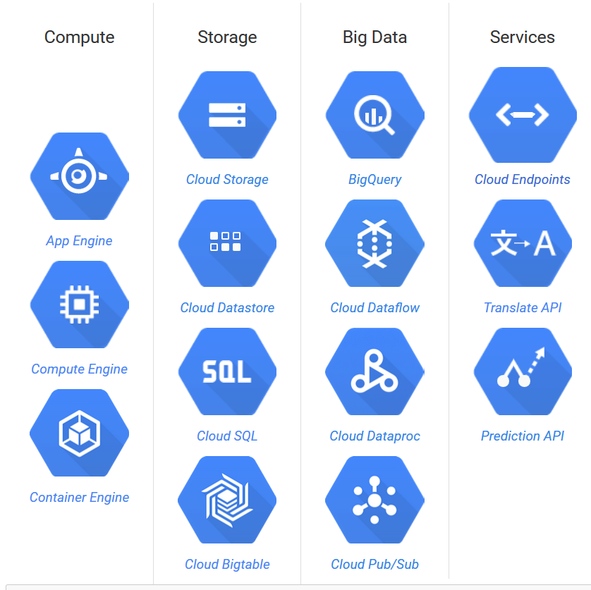

# Proposed solution architecture for Norwegian Tax Administration

The solution architecture is based on the [Google Cloud Platform](https://cloud.google.com/) (GCP). GCP is a set of modular cloud-based services built on the same infrastructure as Google, outlined below.

TODO: Benefits
* Managed
* Pay for what you use
* Pay as you go
* Experimentation
* Scalability
* Future proof
* SaaS

## BigQuery for analytics and scoring
[BigQuery](https://cloud.google.com/bigquery/) is a fully managed, NoOps, low cost, lagrge scale analytics database.