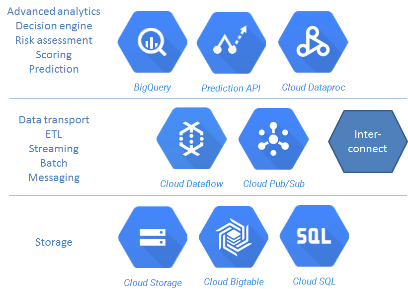
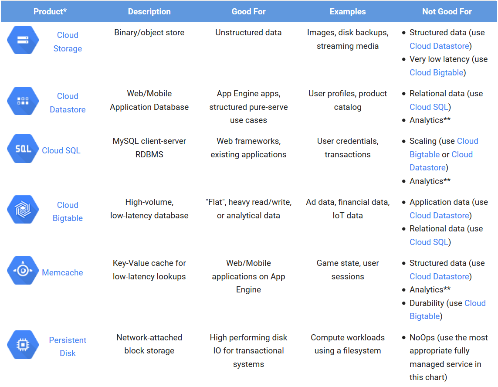

# Proposed solution architecture for Norwegian Tax Administration

The solution architecture is based on the [Google Cloud Platform](https://cloud.google.com/) (GCP). GCP is a set of modular cloud-based services built on Google infrastructure, outlined below.

The benefits of using a cloud platform are many:
* **Managed services**: Infrastructure and operations are managed by Google.
* **Pay as you go**: No need for a huge investment up front.
* **Pay for what you use**: Pay for actual usage instead of guessing capacity demand a long time before any actual experience.
* **Experimentation**: Start small, test hypotheses and technology. Scale fast when solutions are verified.
* **Elasticity**: Scale up and down on demand in development and production.
* **Future-proof**: The cloud is becoming the industry standard. The life cycle of the NTA advanced analytics and risk platform is probably 5-10 years.
* **Reduced risk**: The benefits listed above adds up to a low risk and increases the probability of success.

NTA data will be processed and stored in the Google Cloud Platform. In order to comply with  Personal Data Regulations, we recommend that data is contained within the [European Data Location](http://googlecloudplatform.blogspot.no/2015/04/take-your-big-data-to-new-places-with-Google-BigQuery.html). The Norwegian Data Protection Authority outlines [these steps to store and process data within the EU region](http://www.datatilsynet.no/Teknologi/Skytjenester---Cloud-Computing/):
* Conduct a risk and vulnerability assessment for handling personal data.
 * A license from the Norwegian Data Protection Authority may be required in order to process sensitive personal data, irrespective of cloud processing and storage.
* Sign a Data Processor Agreement with Google. This [agreement](https://cloud.google.com/terms/data-processing-terms) is a part of the [standard agreement](https://cloud.google.com/terms/) from Google.
* Audit the Data Processor, possibly by a third party auditor. [Independent audits](https://cloud.google.com/security/compliance) of infrastructure, services, and operations are executed regularly.
* Ensure that data is not transported outside the EU region.
* Document the system and agreements, available for control by the Norwegian Data Protection Authority.

The main components of the proposed architecture are:
* BigQuery for analytics.
* Prediction API for prediction models and scoring.
* Possibly Cloud Dataproc - Managed Hadoop and Spark - if required.
* Cloud Storage as the main storage for semi-structured data, and possibly  BigTable for very low-latency use cases.
* Cloud SQL (or possibly Cloud Datastore) for common static data.
* Cloud Dataflow for data transport, ETL, batch and stream processing.
* Cloud Pub/Sub for messaging.
* [Carrier Interconnect](https://cloud.google.com/interconnect/) establishes a secure and fast connection between Google Cloud Platform and the NTA.

These components are described further below. 

## BigQuery for analytics
[BigQuery](https://cloud.google.com/bigquery/) is a fully managed, large scale analytics database. Using the processing power of Google's infrastructure, terabytes of data and billions of entries can be queried in seconds.

BigQuery loads data into tables with a schema describing field names and types. Data is queried using the [BigQuery SQL Dialect](https://cloud.google.com/bigquery/query-reference), supporting joins, aggregation, regular expressions, geospoatial queries and more. Views can also be defined, and data can be federated from [Google Cloud Storage](https://cloud.google.com/storage/).

You can access BigQuery by using a [web UI](https://bigquery.cloud.google.com/) or a [command-line tool](https://cloud.google.com/bigquery/docs/cli_tool), or by making calls to the [BigQuery REST API](https://cloud.google.com/bigquery/docs/reference/v2) using a variety of client libraries such as [Java](https://developers.google.com/api-client-library/java/apis/bigquery/v2), [.NET](https://developers.google.com/api-client-library/dotnet/get_started) or [Python](https://developers.google.com/api-client-library/python/). There are also a variety of [third-party tools](https://cloud.google.com/bigquery/third-party-tools) that you can use to interact with BigQuery, such as visualizing the data or loading the data, for instance:
* Simba provides a [BigQuery ODBC driver](http://www.simba.com/drivers/bigquery-odbc-jdbc/) that enables SQL access to BigQuery.
* [Tableau has a native, optimized connector to Google BigQuery](http://www.tableau.com/solutions/google-bigquery) that supports both live data and in-memory BI analytics.

## Prediction API for prediction models and scoring
The [Prediction API](https://cloud.google.com/prediction/) is a decision engine, using machine learning algorithms to analyze data and predict future outcomes. Use cases include fraud detection and suspicious activity identification. Most prediction queries take less than 200ms, and can be used in real time processing.

The Google Prediction API supports [preprocessing your data against a PMML transform](https://cloud.google.com/prediction/docs/pmml-schema) specified using PMML 4.0 syntax. Regression and categorical models are supported:
* Regression model: Given a new item, predict a numeric value - a *score* - for that item, based on similar valued examples in its training data.
* Categorical model: Given a new item, choose a category that describes it best, given a set of similar categorized items in its training data.

[A RESTful API](https://cloud.google.com/prediction/docs/reference/v1.6/) is available through libraries for many popular languages, such as [Python, JavaScript and Java](https://cloud.google.com/prediction/docs/libraries#generic). Results from Google BigQuery can be used directly or datasets can be pulled from  Cloud Storage to create a predictive model.

## Cloud Dataproc - Managed Hadoop and Spark
[Google Cloud Dataproc](https://cloud.google.com/dataproc/) is a managed Hadoop MapReduce, Spark, Pig, and Hive service, to process big datasets at low cost. It provides built-in integration with BigQuery, Cloud Storage, Bigtable, Cloud Logging, and Cloud Monitoring. Cluster Management is automated, handling managed deployment, logging, and monitoring. Clusters can be created and scaled quickly with a variety of virtual machine types, disk sizes, number of nodes, and networking options. 

The [Apache Hadoop](https://hadoop.apache.org/) software library is a framework that allows for the distributed processing of large data sets across clusters of computers using simple programming models. It is designed to scale up from single servers to thousands of machines, each offering local computation and storage. Rather than rely on hardware to deliver high-availability, the library itself is designed to detect and handle failures at the application layer, so delivering a highly-available service on top of a cluster of computers, each of which may be prone to failures. Hadoop implements the MapReduce pattern, pioneered by Google for large scale, distributed batch processing. Hadoop on Google Cloud Dataproc supports:
* The [Apache Hive](http://hive.apache.org/) data warehouse software facilitates querying and managing large datasets residing in distributed storage. Hive provides a mechanism to project structure onto this data and query the data using a SQL-like language called HiveQL.
* The [Apache Pig](http://pig.apache.org/) platform for analyzing large data sets. Pig consists of a high-level language for expressing data analysis programs, coupled with infrastructure for evaluating these programs in parallell.

[Apache Spark](http://spark.apache.org/) is a fast and general engine for large-scale data processing, and is compatible with Hadoop data. It can run in Hadoop clusters through YARN or Spark's standalone mode, and it can process data in HDFS, HBase, Cassandra, Hive, and any Hadoop InputFormat. The Spark platform provides the following libraries which can be combined seamlessly:
* [Spark SQL](http://spark.apache.org/sql/) lets you query structured data inside Spark programs
* [Spark Streaming](http://spark.apache.org/streaming/) to build scalable fault-tolerant streaming applications.
* [MLlib](http://spark.apache.org/mllib/) for scalable machine learning, supporting logistic regression, classification and regression tree, hypothesis testing and several more.
* [GraphX](http://spark.apache.org/graphx/) for graphs and graph-parallel computation. 

We recommend that NTA starts experimenting with BigQuery and the Prediction API. Use the Spark MLLib library if more specific algorithms and methods are required. GraphX can be used for use cases where connected entities are to be analyzed or queried. Both Hadoop and Spark integrates with the popular [R statistics library](http://www.revolutionanalytics.com/revolution-r-open) see [RHadoop](https://github.com/RevolutionAnalytics/RHadoop/wiki) and [SparkR](https://spark.apache.org/docs/latest/sparkr.html).

## Storage
Google offers several options for storing data using the Google Cloud Platform. The table below outlines the [storage alternatives](https://cloud.google.com/docs/storing-your-data) and which data they are suited for:

We expect that the NTA can utilize [Cloud Storage](https://cloud.google.com/storage/) as the main storage for  billions of semi-structured data like XML, JSON or CSV documents. Cloud Storage provides lifecycle management to reduce your costs even further by archiving your objects to Cloud Storage Nearline and through scheduled deletions. An alternative is [BigTable](https://cloud.google.com/bigtable/) for low-latency use cases. Both integrate with BigQuery, Hadoop and Spark. [Cloud Datastore](https://cloud.google.com/datastore/) or [Cloud SQL](https://cloud.google.com/sql/) can be used to handle common static data like code tables and product catalogs. [Memcache](https://cloud.google.com/appengine/articles/scaling/memcache/) can be used for low-latency lookups, for instance finding people or organizations based on SSN or ID lookups.

## Batch Computing, Streaming and ETL
[Cloud Dataflow](https://cloud.google.com/dataflow/) is a unified programming model and a managed service for developing and executing a wide range of data processing patterns. It supports both batch and streaming data processing of any size data set, including an unbounded or infinite data set from a continuously updating data source such as Google Cloud Pub/Sub. The Dataflow service ties together and fully manages several different Google Cloud Platform technologies, such as Google Cloud Storage and BigQuery. You can also use Dataflow for "Extract, Transform, and Load" (ETL) tasks. These tasks are useful for moving data between different storage media, transforming data into a more desirable format, or loading data onto a new storage system.

[Cloud Pub/Sub](https://cloud.google.com/pubsub/) is a fully-managed real-time messaging service that allows you to send and receive messages between independent applications. You can leverage Cloud Pub/Sub’s flexibility to decouple systems and components hosted on Google Cloud Platform or elsewhere on the Internet. By building on the same technology Google uses, Cloud Pub/Sub is designed to provide “at least once” delivery at low latency with on-demand scalability to 1 million messages per second (and beyond).

## Security
[The Google security model](https://cloud.google.com/security/) is an end-to-end process, built on over 15 years of experience focused on keeping customers safe. At the center of the Google security model is our Information Security Team consisting of more than 500 top experts in information, application, and network security. Google data centers feature a layered security model, including safeguards like custom-designed electronic access cards, alarms, vehicle access barriers, perimeter fencing, metal detectors, and biometrics. Google has controls and practices to protect the security of customer information. The layers of the Google application and storage stack require that requests coming from other components are authenticated and authorized. When retired from Google’s systems, hard disks containing customer information are subjected to a data destruction process before leaving Google’s premises.

Google Cloud Platform is built with security as a core design and development requirement. All services are managed through a secured global API gateway infrastructure. This API serving infrastructure is only accessible over encrypted SSL/TLS channels, and every request requires the inclusion of a time-limited authentication token. All platform API requests, such as web requests, storage bucket access, and user account access, are logged. Cloud Platform services automatically encrypt data before it is written to disk. For example, the data for each Cloud Storage object and its metadata is encrypted under the 256-bit Advanced Encryption Standard.

Google has annual audits for the [following standards](https://cloud.google.com/security/compliance):
* SSAE16 / ISAE 3402 Type II:
 * SOC 2
 * SOC 3 public audit report
* ISO 27001, one of the most widely recognized, internationally accepted independent security standards. Google has earned ISO 27001 certification for the systems, applications, people, technology, processes and data centers serving Google Cloud Platform. Our ISO 27001 Certificate is here.
* FISMA Moderate accreditation for Google App Engine
* PCI DSS v3.0

See also the [Google Security Whitepaper](https://cloud.google.com/security/whitepaper)